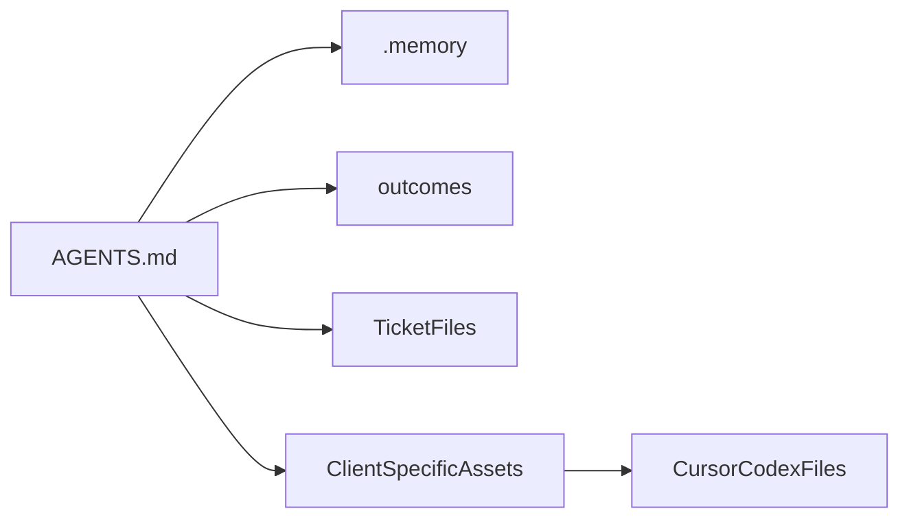

# Architecture

## System Overview

This repository was initialized with a bootstrap-generated agent operating model. The agent layer is split into shared memory, workflow templates, and client-specific instruction assets.

## Bootstrap Topology

1. Shared workflow content lives in `.memory/` and `outcomes/`, with backend-specific delivery guidance in `.memory/delivery-backend.md`.
2. Delivery execution lives in repo-local `tickets/` files that link back to shared outcomes and memory.
3. Client-specific instructions are rendered into tool-specific directories.
4. The installed bootstrap manifest in `.agent-bootstrap.json` tracks generated files and selected backend settings for upgrades and health checks.

## Repo Profile

- Package scope: `@conductor`
- Workspace style: `monorepo`
- Stack profile: `conductor-framework`
- Delivery backend: `local-files`
